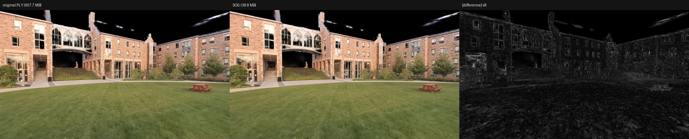
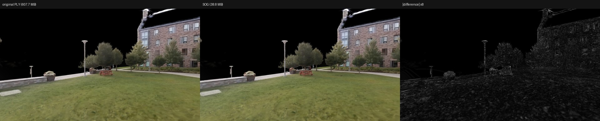
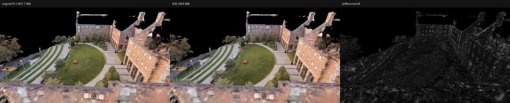

# Phase 0 results: ground truth (2026-09-29)

**Outcome:** SOG is a safe target for NanoGS.
- The scene compresses 15.7x (607.7 MB → 38.8 MB) and renders at 39–41 dB PSNR against the original,
  which is visually indistinguishable.
- `splat-transform` keeps the PLY's axes, so NanoGS's existing PLY mapping applies unchanged.
- The planned 20-byte GPU record and Metal decode are proven exact on the full scene.
- One correction to the plan: NanoGS's GPU footprint today is ~384 MB, not the 494 MB cooked payload the
  plan quoted, so SOG saves ~308 MB of GPU memory (almost all of it SH) and ~418 MB of cooked data.

Source asset: `SHUTourDemo/SourceData/scene_building_nosky.ply` (2,575,004 splats, SH band 3), the scene
behind `/Game/Gaussian/scene_nosky`. Tools: `@playcanvas/splat-transform` 3.7.0 on Node 26.10,
Apple M4 (MacBook Air, 16 GB).

## 1. Encoding

| | Original PLY | SOG |
|---|---|---|
| Size | 607.7 MB (236 B/splat) | 38.8 MB (15.1 B/splat) — **15.7x smaller** |
| Encode | — | 81.5 s (78.9 s of it SH k-means on the GPU), peak 2.1 GB RAM |
| Decode back to PLY | — | 1.4 s |

Bundle contents: `means_l` 7.5 MB, `means_u` 1.4 MB, `quats` 8.1 MB, `scales` 7.2 MB, `sh0` 7.8 MB,
`shN_labels` 4.5 MB, `shN_centroids` 2.3 MB, `meta.json` 15.6 KB ([copy](../results/scene_nosky_meta.json)).
Per-splat images are 1608×1604 RGBA (2,579,232 texels ≥ count); the SH palette is full: 65,536 entries,
3 bands, 960×1024. `antialias` is absent (false).

## 2. Coordinate frame

- The decoded SOG has **the same bounds and centroid as the source PLY** (to 0.5 mm), so `splat-transform`
  doesn't reorient: the data stays in the 3DGS/COLMAP frame (x right, y down, z forward) even though the
  SOG spec describes y-up. SOG reorders splats (Morton order); 99.991% pair up by mutual nearest neighbour.
- For NanoGS, the file→local transform is therefore its PLY importer mapping, local cm = 100·(z, x, −y),
  stored as `kNanoGSFileToLocal` in `sog/SOGTypes.h`. It's a reflection (determinant −1).
- Applying it to the covariance in the shader (the plan's approach) is **identical** to NanoGS's import-time
  quaternion conversion: max relative difference 3×10⁻¹⁶ over 200,000 real splats
  ([frame_check.json](../results/frame_check.json)). Quaternions can stay untouched.
- NanoGS's SH evaluation already maps the view direction back to the PLY frame, which is exactly the
  inverse of this transform, so SH needs no change either.
- Caveat for Phase 1: SOG files from other tools (e.g. edited and exported from SuperSplat) may be y-up.
  The importer needs a frame option and a test file from SuperSplat.
- Tooling note: `splat-transform`'s image renderer negates the file's x and y for camera coordinates.

## 3. Decoder and GPU-layout validation

| Check | Result |
|---|---|
| Our Python SOG v2 decoder vs `splat-transform`'s own decode | Exact: SH, scale, DC 0 difference; position ≤ 4.8×10⁻⁷ m (float32 PLY rounding) |
| 20-byte record + float32 decode (Python mirror of the Metal code) | Position ≤ 4.7 µm, quaternion ≤ 3.4×10⁻⁷, scale ≤ 5.6×10⁻⁸ relative |
| `shaders/SOGDecode.metal` compiled with `-Werror`, run on the M4 GPU over all 2,575,004 splats | All fields pass ([metal_test_result.json](../results/metal_test_result.json)); **5.6 ms** for the whole scene including SH3 colour and local covariance |
| `sog::PackSplat` (C++17, `-Wall -Wextra -Werror`) vs reference records | 0 mismatches in 2,575,004; struct sizes 20 and 112 bytes ([pack_test_result.json](../results/pack_test_result.json)) |

GPU worst-case errors: position 3.8 µm, quaternion 1.8×10⁻⁷, scale 9×10⁻⁸ relative, opacity 6×10⁻⁸,
SH3 colour 1.7×10⁻⁴ (≈ 0.04 of an 8-bit level, from the half-float palette), covariance 1.3×10⁻⁶ relative.

Golden vectors for the Phase 1 importer tests: [golden_scene_nosky.json](../results/golden_scene_nosky.json)
(56 splats including all four quaternion modes and the extremes, with records, tables and decoded values).

## 4. Fidelity: original PLY vs SOG

Per-attribute error over 2,574,780 matched splats:

| Attribute | Median | p99 | p99.9 |
|---|---|---|---|
| Position | 0.18 mm | 0.45 mm | 0.55 mm |
| Position, relative to splat size | 1.9% | 14% | 24% |
| Scale (log) | 0.0092 (≈0.9%) | 0.025 | 0.035 |
| Rotation | 0.90° | 1.44° | 1.75° |
| Opacity | 0 | 1/255 | 1/255 |
| Base colour | 0.34 of an 8-bit level | 1.07 levels | 2.96 levels |
| SH bands 1–3 (per-splat RMS) | 0.017 (33% of magnitude) | 0.047 | 0.070 |

- Position error is 0.7 mm at worst in file units, about 3.5 mm in the Unreal world after the actor's 5×
  scale.
- The SH palette (k-means, 65,536 entries) is the lossiest part. It's small in absolute terms, and phones
  only evaluate band 1 today.
- Extremes are rare: at most 90 splats per attribute exceed "large" thresholds (rotation > 10°, scale
  error > 0.2 in log, colour > 8 levels, opacity > 0.05), ≤ 0.004% of the scene. None of the source scales
  fall outside SOG's codebook range (23 base colours do), which points to near-duplicate splats paired with
  the wrong partner rather than to encoding loss.

Rendered comparison with `splat-transform`'s renderer at 1280×720 ([render_compare.json](../results/render_compare.json)):

| View | PSNR, all pixels | PSNR, non-background | Pixels off by > 8 levels |
|---|---|---|---|
| Lawn, eye level (east) | 40.6 dB | 39.9 dB | 1.8% |
| Lawn, eye level (west) | 43.1 dB | 41.1 dB | 0.6% |
| Overview | 40.5 dB | 39.2 dB | 2.1% |





## 5. Memory (corrects the plan)

NanoGS already packs position, rotation, scale and colour to **16 bytes per splat** on the GPU, but keeps
all three SH bands as Float16 (**96 bytes per splat**). For `scene_nosky` with its LOD splats (3,432,502):

| | GPU resident | Cooked payload |
|---|---|---|
| NanoGS today | 384 MB (55 MB core + 330 MB SH) | 494 MB |
| SOG storage (20-byte records + 7.9 MB half-float SH palette) | **76.5 MB** | ~77 MB before pak compression |
| Saving | **~308 MB** | ~418 MB |

The plan's "~144 bytes per splat, 494 MB" was the cooked bulk payload, not GPU residency.

## 6. Implications for Phase 1

1. **No frame conversion** for `splat-transform` output: use `kNanoGSFileToLocal`, plus a y-up option.
2. **Pick the GPU representation first.** Phase 0 surfaced a cheaper option than the plan assumed:
   - **A. Full 20-byte SOG record** (plan as written): no second quantization, best fidelity, needs the new
     decode path in `CalcViewData`. Recommended for SOG-sourced assets.
   - **B. NanoGS's 16-byte core + a 2-byte SOG SH label + palette** (18 bytes/splat): keeps the existing
     unpack, replaces only the SH load, gets ~95% of the memory win. But SOG values get requantized into
     NanoGS's core (float16 positions are coarser than SOG's 16-bit log positions), and the same palette
     trick could serve PLY imports too if NanoGS clustered SH at import (its unimplemented `Cluster64k`).
3. **WebP:** Pillow (libwebp) decodes the SOG images exactly, as the round-trip checks prove. Use libwebp
   in the importer; keep ImageIO/CoreGraphics out of the path.
4. **SH quality** is the thing to watch on device. `splat-transform -i` raises SH k-means iterations if
   needed (default 10).

## 7. Not done, and why

**No Unreal asset was created from the round-trip PLY.**
- The editor was closed, and NanoGS's Nanite (cluster) build is only reachable from the Asset Actions menu.
  It isn't scriptable.
- An import would also have put a ~430 MB unversioned asset into the Perforce workspace.
- The round-trip PLY's header is identical to the original's (same 59 properties, same order), so NanoGS
  reads it unchanged.

To look at SOG-quality content in the engine: import `data/scene_nosky_roundtrip.ply`, then
Asset Actions → Nanite → Enable.

## Reproduce

```bash
tools/phase0/run_phase0.sh "/Volumes/External SSD/Unreal Projects/SHUTourDemo/SourceData/scene_building_nosky.ply"
```
