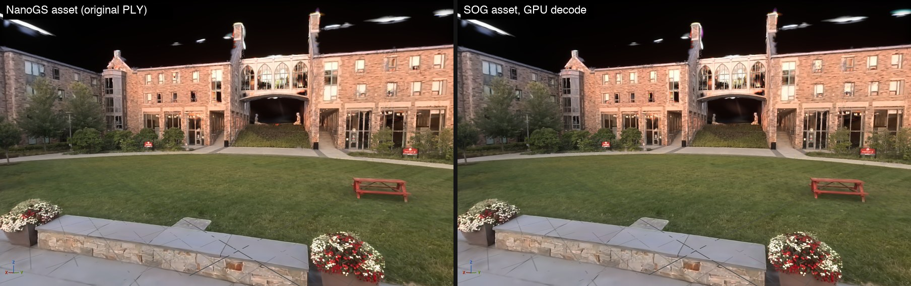
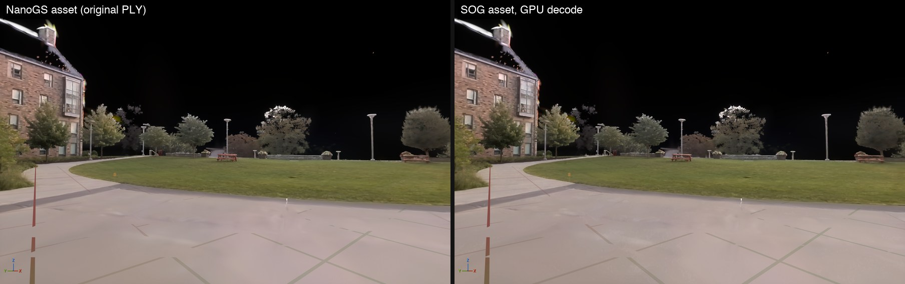

# Phase 2 results: GPU decode and sorting (2026-09-29)

**Outcome:**
- **GPU decode.** SOG assets render straight from their 20-byte records. `CalcViewData` decodes position, rotation, scale, opacity and SH on the GPU and writes the same per-splat view data as before.
- **Storage.** SOG assets no longer store NanoGS's own splat buffers:
  - `scene_nosky` is 90 MB on disk instead of 508 MB.
  - It uses about 77 MB of GPU memory instead of about 412 MB.
- **Image quality.**
  - On identical splats, the SOG path matches NanoGS's own path to 41–46 dB.
  - Against the shipping asset, the only difference is SOG's own compression.
- **Speed on the M4.** The splat pass went from 34.3 ms to about 21.6 ms (editor viewport, 3051×1932, about 1M visible splats):
  - Culling, view data and sort: 10.5 → 2.2 ms.
  - Draw: about 24 → 19 ms.
- **Not done yet:** the iPhone 13 Pro capture, which is Phase 2's done criterion. The phone wasn't connected.

The Unreal-side changes are in **pending Perforce changelist 363 (not submitted)**, together with Phase 1.
Review snapshot: [integration/nanogs-phase2.patch](../integration/nanogs-phase2.patch), on top of
[nanogs-phase1.patch](../integration/nanogs-phase1.patch).



## What changed

**GPU decode**

- **Shader.** `SOGDecode.ush` is the HLSL port of `shaders/SOGDecode.metal`. It now lives in this repo as `shaders/SOGDecode.ush`, and `tools/sync_nanogs.sh` copies it to the plugin.
- **Permutation.** `CalcViewData` has a `GS_SOG` permutation. Each permutation declares only the buffers it reads, so neither has to bind the other's; D3D12 treats an unbound buffer that a shader uses as fatal (the change 358 crash).
- **Buffers:**
  - The records, 20 bytes per splat.
  - One table buffer: the scale lookup table followed by the DC lookup table (`float[512]`).
  - The half4 SH palette.
  - Constants: the three rows of the file→local transform, and the log-domain position range.
- **Maths:**
  - Covariance is M·R·S²·Rᵀ·Mᵀ.
  - The SH direction is Mᵀ applied to the camera→splat direction, which reproduces NanoGS's hard-coded PLY axis swap.
  - Records flagged no-SH (NanoGS's merged LOD splats) skip the palette.
- **Metal blueprint.** `shaders/SOGDecode.metal` now honours the no-SH flag too.

**SOG-only assets**

- **`InitializeFromSOG`:**
  - Takes the bounds and thumbnail from the decoded splats.
  - Drops NanoGS's position, rotation/scale, colour texture, SH and chunk data.
  - Stores only the SOG payload.
  - Import, Nanite build and Nanite clear all use it.
- **Loading.** The render data loads records, tables and palette instead of packing 16-byte splats.
- **Other asset functions.**
  - `IsValid` accepts SOG-only assets.
  - `GetDecompressedPositions` decodes the records.
- **Compatibility.** Assets imported from PLY are unchanged and still write version 5.

**Sorting**

- **Scatter ranking.** The radix scatter ranks elements with one bit per thread per digit and popcounts, instead of scanning every earlier element of the tile. The result is the same stable order, and it was the largest single win.
- **16-bit keys.** `gs.SortKeyBits` defaults to 32 (float depth, 4 passes). At 16 it uses log view depth from the near plane to `gs.SortKeyFarDistance` (default 1 km), sorted in 2 passes, for perspective views only.
  - Resolution is 0.014% of the depth.
  - The iOS and Android device profiles set it to 16.
- **Validation.** `gs.ValidateSort 1` reads back the sorted keys and indices and logs whether they are ordered and form a permutation.

**View data: 64 → 32 bytes, on every platform**

- **Layout.** Translated world position, packed cluster ID and flags, half-float colour, half-float axes.
- **Vertex shader.** It derives the clip position from the translated world position with the current un-jittered matrix.
- **Sort keys.** `CalcViewData` writes them directly, so the `CalcDistances` pass is gone.
- **Velocity.** The splat-centre velocity is now computed once per vertex. The pixel shader used to repeat that maths for every pixel; the value is identical because it is constant across the quad.

**Profiling**

- **GPU stats.** `NanoGSViewData`, `NanoGSSort`, `NanoGSDraw` and `NanoGSComposite` appear in `stat gpu`, `ProfileGPU` and CSV profiles (`-csvGpuStats`). In the 2026-09-03 phone baseline the splats had no stat and showed up only as "Unaccounted".
- **Metal caveat.** Metal timestamps once per compute encoder. The whole prepare pass is one encoder, so on Metal `NanoGSViewData` includes culling, compaction, view data and sort, and `NanoGSSort` reads 0.

## Results

**Correctness**

| Check | Result |
|---|---|
| `NanoGS.SOG.*` (4 tests, headless) | All pass. Import produces a SOG-only asset. After the Nanite build, each record is checked against an independent float build: base positions within 0.0002 cm, LOD positions within 0.032 cm, LOD scale log error 0.072 max (0.007 mean), LOD opacity within half an 8-bit step |
| SOG GPU decode vs NanoGS's path on identical splats (the SOG round-trip PLY) | 41–46 dB full frame over three views. Repeating the same capture varies by 36–48 dB (temporal AA, tie order) |
| SOG asset vs the shipping asset (original PLY) | 34–41 dB. This is SOG's compression error; Phase 0 measured 39–41 dB |
| View-dependent SH term (SH3 render minus SH0 render) | Correlation 0.92–0.93 between the two paths, with the same magnitude, so the SH frame is right |
| `gs.ValidateSort` | 72/72 frames correct, about 1M keys each, in both 16-bit and 32-bit mode |
| 16-bit vs 32-bit keys | 43 dB. 1% of pixels differ by more than 8 levels, where near-coplanar splats swap order. Frame-to-frame with AA off: 46 dB (16-bit) vs 54–58 dB (32-bit) |
| 32-byte view data and per-vertex velocity vs the previous path | Within the capture noise |
| Metal blueprint test (`tools/phase0`) | Same results after the no-SH change |
| iOS game target | Compiles and links (155 s) |

**Speed**

Measured on the M4 MacBook Air in the editor: 3051×1932 viewport, about 1M visible splats, camera moving.
Each figure is the median of 7 `ProfileGPU` frames; times in ms.

| Build | Asset | Keys | Prepare | Draw | Splat pass |
|---|---|---|---|---|---|
| Phase 1 | NanoGS | 32-bit | 10.48 | 23.6 | 34.3 |
| + bitmask scatter ranking | NanoGS | 32-bit | 4.95 | 25.3 | 30.5 |
| | SOG | 32-bit | 4.05 | 24.1 | 28.5 |
| | SOG | 16-bit | 3.15 | 24.5 | 27.9 |
| + 32-byte view data, keys from `CalcViewData`, per-vertex velocity | NanoGS | 32-bit | 3.96 | 19.3 | 23.5 |
| | SOG | 32-bit | 3.22 | 20.1 | 23.6 |
| | SOG | 16-bit | 2.15–2.21 | 18.8–19.5 | 21.2–22.0 |

For reference, the Phase 1 scatter with the SOG asset took 9.84 ms (32-bit keys) and 6.23 ms (16-bit).

Draw times drift by about ±2 ms between runs as the fanless M4 warms up. The draw is now 90% of the
splat pass, which is Phase 3's territory.

**Memory** (`scene_nosky`: 3,432,502 splats including LOD splats, 22,994 clusters)

| | NanoGS asset | SOG asset |
|---|---|---|
| Package on disk | 508 MB | 90 MB |
| Splat payload (`GetMemoryUsage`) | 524 MB | 78.6 MB |
| GPU splat data | About 412 MB: 16-byte records 55 MB, SH 330 MB, colour texture 27.5 MB | 76.6 MB: records 68.7 MB, palette 7.9 MB, tables 2 KB |
| Per-frame view data (all assets) | 64 B per splat | 32 B per splat |



## Deviations from the plan

- **32-byte view data everywhere, not just on mobile.**
  - The only precision given up is half-float axes.
  - It avoids a second permutation and a buffer-stride switch.
- **Sort keys come from `CalcViewData`.** The separate `CalcDistances` pass is removed.
- **Velocity moved from the pixel shader to the vertex shader.**
  - It is a rasterization change (Phase 3), taken now because the vertex shader's inputs changed anyway.
  - The maths is the same.
- **The radix sort kept its reduce-then-scan structure, but its scatter ranking was rewritten.** The old in-tile scan did O(n²) work per tile; removing it roughly halved the prepare pass on its own.
- **No 13 Pro capture yet.**

## Before submitting changelist 363

- **Rebuild Win64 on the Alienware** (unchanged from Phase 1). The new shaders avoid FXC pitfalls such as reused loop variables, but they have only been compiled for Metal.
- **SOG assets need the new binaries everywhere.**
  - They are version 6 and SOG-only.
  - A build without the GPU decode can't draw them.

## Next

- **13 Pro capture (Phase 2 done criterion).** It needs the phone plugged in and unlocked, plus a decision on how the level should use the SOG asset: point `SHUCampusLevel` at a new SOG asset, or reimport `scene_nosky` from `.sog`.
  - The new GPU stats will separate the splat pass from "Unaccounted".
  - The sort, view-data and velocity changes help the NanoGS asset as well.
- **Cleanup.** `GaussianSplatRenderer` still has per-proxy dispatch and draw functions that nothing calls. Their per-proxy view data and sort buffers are never allocated.
- **Phase 3:** rasterization for tile-based GPUs. The draw now dominates.

## Reproduce

```bash
tools/sync_nanogs.sh --check      # plugin copies of sog/ and shaders/SOGDecode.ush match this repo
NANOGS_SOG_TESTDATA="$PWD/data" UnrealEditor SHUTourDemo.uproject -ExecCmds="Automation RunTests NanoGS.SOG" \
    -TestExit="Automation Test Queue Empty" -unattended -nullrhi -NoP4
```

A/B renders and GPU timing in the editor: [tools/phase2/README.md](../tools/phase2/README.md).
