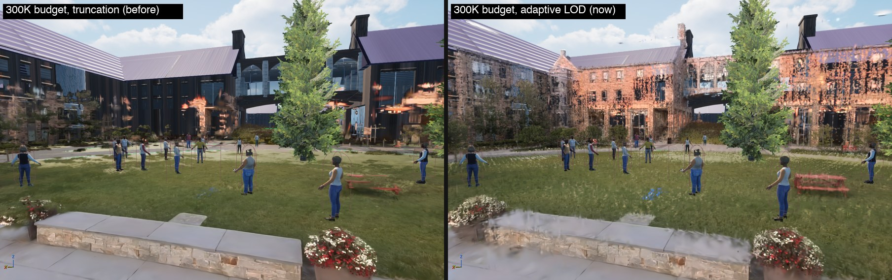
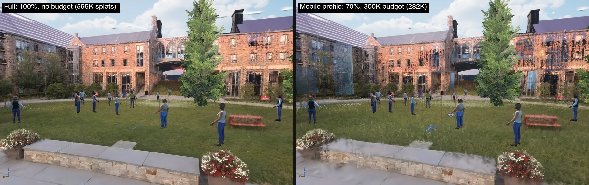
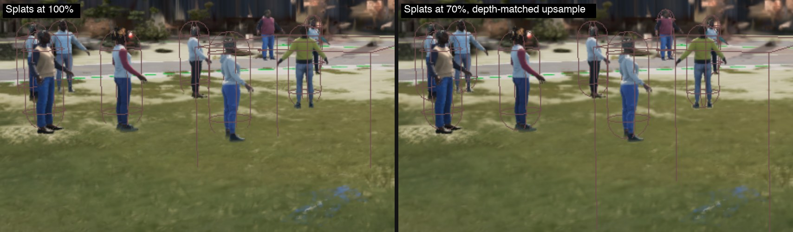

# Phase 3 results: rasterization for tile-based GPUs (2026-09-29)

**Outcome:**
- **The campus level now uses SOG.** `SHUCampusLevel` renders from a new SOG asset, `/Game/Gaussian/scene_nosky_sog`. The shipping `scene_nosky` asset is untouched.
- **Splat pass on the M4 with mobile settings: 5.9 → 3.8 ms (−36%).** This is the quad view with the crowd.
- **The render budget no longer deletes scenery.** Before, a budget below the visible splat count removed whole buildings. It now makes LOD coarser instead.
- **Not done:** the iPhone 13 Pro check (a steady 30 fps in the quad view), which is this phase's done criterion. The phone wasn't connected, so it still needs doing.

All changes are in **pending Perforce changelist 363 (not submitted)**:
- The code, with a review snapshot in [integration/nanogs-phase3.patch](../integration/nanogs-phase3.patch).
- The new asset.
- `SourceData/scene_building_nosky.sog`.
- The level, which is now checked out with its exclusive lock.



## What changed

**Cheaper splat draw**

- **Opacity-aware quads.** The vertex shader shrinks each quad to the radius where the pixel shader's falloff, times the splat's opacity, drops to 1/255.
  - Pixels outside that radius were already discarded, so the image is unchanged; there are just fewer fragments.
  - `CalcViewData` also drops splats below 1/255 opacity before they reach the sort.
- **Velocity only when something reads it.** `gs.SplatVelocity` defaults to auto: the velocity render target and TSR/TAA's responsive-AA stencil bit are written only when the view uses temporal AA or motion blur.
  - With mobile FXAA, the draw blends into one render target instead of two.
  - A new shader permutation (`GS_WRITE_VELOCITY`) removes the velocity code from both the vertex and pixel shaders.
- **Depth writes.** `gs.SplatDepthWrite` offers a read-only depth test.
  - The default stays on: depth writes cost nothing measurable on the M4, which is a tile-based GPU like the phone's.
  - Translucency drawn after the splats relies on their depth to be hidden behind them.
- **Reduced-resolution splats (`gs.ScreenPercentage`).** The splats draw into a smaller target, then get upsampled.
  - A small pass writes the nearest scene depth for each low-res pixel, and the splats depth-test against it.
  - The composite upsamples with bilinear taps, keeping only taps whose depth matches the full-resolution pixel. Crowd and other silhouettes stay sharp, with no halo.
  - It needs the splats to write no velocity, so it only applies with FXAA-style anti-aliasing.
  - The iOS and Android device profiles set it to 70.
- **Antialiased assets.** SOG assets trained with antialiasing (`meta.json` `"antialias": true`) get Mip-Splatting's opacity compensation. `scene_nosky` wasn't trained that way.

**Render budget**

- **The bug.** `gs.MaxRenderBudget` used to cut the list of visible splats at N.
  - That list comes out in cluster (Morton) order, so the cut removed whole regions.
  - With the iOS profile's 300K budget, the quad view lost its buildings: 595K splats were visible at 1638×1038.
- **The fix.** The renderer reads back each frame's visible count and scales every proxy's LOD error threshold until the visible splats fit.
  - It coarsens above 95% of the budget and relaxes below 70%.
  - The hard cap stays only as a guard against transient spikes.
  - The budget is now part of the camera-static cache key, so changing it takes effect even when the camera is still.

**Content**

`scene_nosky_sog` was imported from the same `splat-transform` output used since Phase 0 and built with Nanite:
3,432,502 splats, 22,994 clusters, a 90 MB package. `SHUCampusLevel`'s splat actor now points at it.
`DefaultLevel` still uses `scene_nosky`.

## Results

**Speed**

Measured on the M4 in the editor, in the campus quad view: 1638×1038 render, camera moving, 7-frame medians.
Settings match iOS: FXAA, 16-bit sort keys, SH order 1, LOD threshold 0.08, 300K budget. Times in ms.

| Configuration | Prepare | Draw | Composite | Splat pass |
|---|---|---|---|---|
| Phase 2 (truncating budget, velocity + depth writes, full quads) | 0.77 | 4.95 | 0.20 | 5.9 |
| + opacity-aware quads, adaptive budget | 0.70 | 4.08 | 0.22 | 5.0 |
| + no velocity (auto with FXAA) | 0.71 | 3.60 | 0.21 | 4.5 |
| + splats at 70% (**mobile profile**) | 0.68 | 2.86 | 0.26 | **3.8** |

- **Opacity-aware quads** shrink the average quad by 12% for this scene (median opacity 0.52). The draw only gets about 2% faster, because the near, mostly opaque splats that cover the most pixels barely shrink.
- **Velocity output** cost 0.5–1.0 ms of draw.
- **Depth writes** cost nothing measurable: 11.21 ms without them vs 11.22 ms with, in an unbudgeted run.
- **Resolution-independent draw cost.** At 300K splats the draw time splits into about 2.1 ms that doesn't depend on resolution and 1.9 ms of pixel work at 100%. The fixed part is the vertex shader and primitive setup.
- **Other resolutions:** 50% brings the draw to 2.65 ms.

**Image quality**

| Check | Result |
|---|---|
| Opacity-aware quads, velocity off | Same pixels by construction; within capture noise |
| 70% and 50% splat resolution vs 100% | 28.5 and 26.9 dB (repeat captures of one setup differ by 31 dB: moving clouds, tie order). NPC silhouettes stay clean; the splat layer is softer at 70% and blurry at 50% |
| Budget 300K, before and after | Before, whole buildings disappeared. After, everything is present at coarser LOD: some facade gaps and a smeared bench close to the camera (see below) |
| Budget settling (camera moving) | 300K → about 282K visible, 500K → about 378K, steady with no oscillation. LOD changes in steps, so it lands below the target |
| `gs.ValidateSort` under the mobile profile | 93 of 93 frames correct |
| `NanoGS.SOG.*` | 4 of 4 pass |
| iOS game target | Compiles and links |





## Deviations from the plan

- **Opacity-aware extent.** The plan suggested a quad radius of σ·√(2·ln(255α)). I sized it to NanoGS's existing falloff instead, which normalizes to zero at 2√2 σ. That keeps the image identical.
- **No sub-pixel culling.** NanoGS dilates every splat by 0.3 px², so any splat above 1/255 opacity already reaches at least one pixel. Culling small splats would change the image; the antialias compensation covers assets trained for it.
- **Depth writes stay on by default.** A read-only depth test didn't save anything on the M4.
- **Premultiplied blending was already in place.**
- **The budget fix wasn't in the plan.** Without it, the 30 fps target would be reached by rendering half a campus.

## Next

- **iPhone 13 Pro capture** for both Phase 2 (splat pass under 18.3 ms) and Phase 3 (quad view at 30 fps). It needs the phone plugged in and unlocked, then a cook and deploy.
  - The GPU stats `NanoGSViewData`, `NanoGSDraw` and `NanoGSComposite` now show up in `-csvGpuStats` captures.
- **LOD quality.** NanoGS merges a cluster's children into LOD splats by averaging their scales and dropping rotation, so coarse levels leave gaps. Merging with the children's full covariance, including their spread, would close them. That matters now that the budget works by coarsening LOD.
- **Budget value.** The pipeline is faster now, so re-tune `gs.MaxRenderBudget` on the device. LOD steps mean intermediate budgets settle lower than their target.
- **The fixed per-splat draw cost** (about 2.1 ms at 300K on the M4). Two ideas:
  - Draw only the valid splats: 11% of the sorted list is culled in the quad view.
  - Store view data in sorted order so the vertex shader reads memory in sequence.

## Reproduce

In the editor, per [tools/phase2/README.md](../tools/phase2/README.md), with the campus level open:

```bash
SWAY_AT="2541,-2611,872,-4,132" tools/phase0/.venv/bin/python tools/phase2/ab.py profile "mobile profile" - \
    r.AntiAliasingMethod=1 gs.MaxRenderBudget=300000 gs.SortKeyBits=16 gs.OverrideSHOrder=1 \
    gs.OverrideLODErrorThreshold=0.08 gs.ScreenPercentage=70
```
