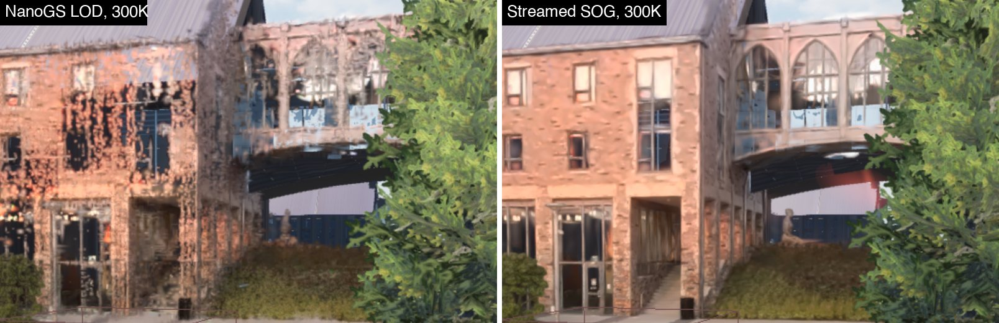
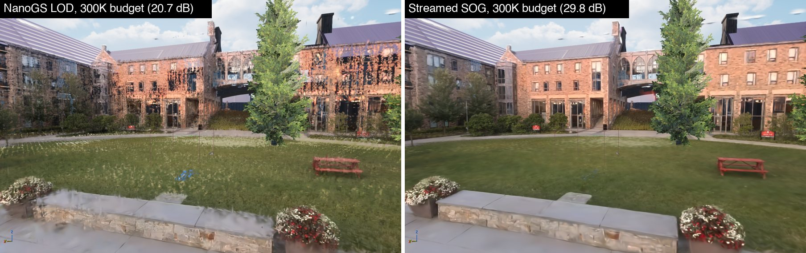
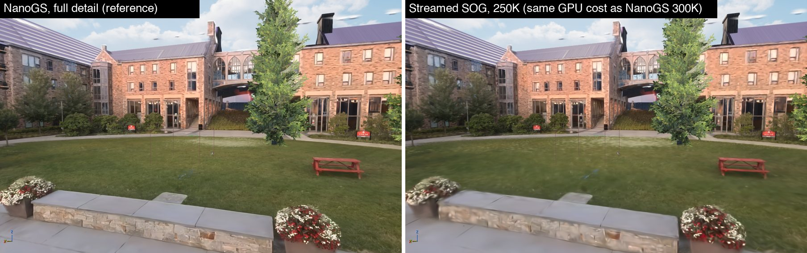

# Phase 4 results: Streamed SOG (2026-09-29)

**Outcome:**
- **Streamed SOG imports into NanoGS.** A `lod-meta.json` (splat-transform's Streamed SOG: LOD levels split into
  chunk SOGs) imports as one asset. It draws one LOD level per leaf of the tree, chosen each frame.
- **Better LOD at the same cost.** In the campus quad view, at the iOS profile's 300K-splat budget:
  - NanoGS's own LOD scores 20.7 dB against full detail. Its merged splats leave holes in the facades.
  - The Streamed SOG scores 29.8 dB with no visible holes.
  - At equal GPU time (Streamed SOG at 250K vs NanoGS at 300K, about 4.1 ms on the M4) it's still 28.4 dB vs 20.7 dB.
- **The budget is met exactly.** With `gs.MaxRenderBudget` set, the level choice fills the budget, refining the
  most visible leaves first (PlayCanvas's approach) instead of the adaptive threshold that settled below it.
- **Streaming with a residency budget** (`gs.StreamingPoolSplats`):
  - The coarsest level stays resident. Finer levels load from disk into a fixed pool on demand, least recently used out first.
  - With a 600K-splat pool, the campus asset's GPU buffers shrink from about 125 MB to about 31 MB (NanoGS's own asset: about 92 MB).
  - Once pages load it renders the same image as the fully resident asset (38 dB, capture noise). The pool is set to 600K in the iOS and Android device profiles.
- **Not done:** the iPhone 13 Pro check, and the Win64 build (both still open from Phases 2–3).

The Unreal-side changes are in **pending Perforce changelist 363 (not submitted)**, with a review snapshot in
[integration/nanogs-phase4.patch](../integration/nanogs-phase4.patch). A new asset,
`/Game/Gaussian/scene_nosky_streamed`, holds the campus scene as a Streamed SOG; it isn't in Perforce yet and the
level still uses `scene_nosky_sog`.



## What changed

**Test data**

`tools/phase4/make_streamed.sh` builds a Streamed SOG from the scene's PLY with splat-transform 3.7.0:
- It decimates to 50%, 25% and 10% with `-d`. splat-transform merges neighbouring splats and keeps their combined
  shape and coverage (moment matching).
- It then bundles the four levels with `--lod-chunk-count 64 --lod-chunk-extent 2 --lod-errors`:
  4,763,757 splats, 284 leaves of about 1.3 m, 67 chunk folders.

`errors` in `lod-meta.json` are **relative image errors**. splat-transform renders each leaf from six directions at
every level and compares against its finest level. They aren't distances.

**Merging the chunks (the `sog/` library, `SOGStreamed.h`)**

Each chunk is an ordinary SOG with its own codebooks and its own SH palette. splat-transform sizes each palette at
about one entry per splat: 4.2 million entries for the campus, about 500 MB as half floats. So the importer merges
everything into one asset laid out like a single `.sog`:
- One scale codebook and one DC codebook of 256 entries: 1-D k-means over every chunk's entries, weighted by use.
  Scales are also weighted by size, so the large, visible splats keep precise entries.
- One SH palette of 65,536 entries (16-bit labels): weighted k-means over the 2.9 million palette entries in use.
  It runs hierarchically: 256 groups, then about 256 entries per group, with larger groups split again.
- Positions are requantized into the union of the chunks' ranges. Quaternions and opacities are copied bit for bit.
- Records are ordered coarsest level first, then by leaf, then in Morton order. So each (leaf, level) run is
  contiguous and the coarsest level is a prefix. Runs are cut into clusters of up to 128 splats, with bounds padded by
  3 sigma.

Checked record by record against the source chunks (4.76M splats):

| Attribute | p99 | p99.9 | Max |
|---|---|---|---|
| Position | 0.22 mm | 0.27 mm | 0.36 mm |
| Scale, axes ≥ 1 mm (log ratio) | 0.020 | 0.028 | 0.34 |
| DC colour (clamped to 0–1) | 0.005 | 0.0065 | 0.008 |

- SH: relative RMS error 0.39 against the chunks' own palettes. For comparison, the single-file SOG's palette loses 33%
  against the original PLY. Phones only evaluate SH band 1.
- More k-means iterations don't help (0.393 at 4, 0.390 at 32); the palette size is the limit.

The merge takes about 4 s in the standalone build. Inside the editor the SH clustering takes about 30 s, so a full
import is about 30 s. The gap wasn't investigated; see Next.

**NanoGS**

- **Asset (version 7).** A per-leaf table: bounds, per-level errors, splat counts and cluster ranges. The clusters go
  in the existing cluster hierarchy as leaves whose `LODLevel` is the level. `FGaussianGPUCluster` uses one padding
  word for the leaf index. Assets without streamed data still save as version 5 or 6.
- **Import.** The factory accepts `lod-meta.json` next to its chunk folders. Nanite rebuild and clear refuse streamed
  assets.
- **Level choice, on the CPU per view.**
  - A leaf of radius r at distance d covers f = r / (r + d · tan(fov/2)) of the half-screen.
  - With a budget, every visible leaf starts at its coarsest level. The level choice then refines the leaf with the
    largest f² × (error reduction) / (added splats), until the budget is spent.
  - Without a budget, a leaf takes its coarsest level with error × f² ≤ (2T)², where T is the component's
    `LODErrorThreshold`. The factor 2 matches NanoGS's own LOD cost at the default T (see Results).
  - `gs.DebugForceLODLevel` forces a level everywhere. `gs.StreamedLODStats 1` logs the choice once a second.
- **Culling.** A new permutation of the cluster culling pass keeps a cluster only when its level is the one chosen for
  its leaf. Compaction, view data, sort and draw are unchanged.
- **Budget sharing.** The adaptive threshold controller now only scales other (non-streamed) assets, and Streamed SOG
  assets choose within whatever those leave.
- **Buffers.** Compaction is sized for the most one view can select (2.58M for the campus, not 4.76M). The global
  buffers likewise.

**Streaming (`gs.StreamingPoolSplats`, 0 = off by default, 600000 in the iOS and Android profiles)**

- **Pool layout.**
  - The coarsest level stays at the start of the record buffer, where the asset has it: it's the record prefix, read
    with one ranged read when the asset loads.
  - After it, the buffer is a pool of 128-record blocks, one cluster per block. The position→cluster map covers the pool.
- **Pages.** Each finer (leaf, level) run of the asset's record bulk data is a page (852 for the campus), read with
  ranged `FBulkDataBatchRequest` reads, the same mechanism Nanite streaming uses.
- **Per frame.**
  - After the level choice, the residency manager marks the pages the view draws as used and queues the levels it
    wants that aren't resident.
  - It moves finished reads into free blocks. When the pool is full it evicts the least recently drawn pages that no
    view drew this frame.
  - The view then draws the finest resident level at or coarser than what it wanted; the coarsest level is always
    there.
  - Reads are only issued when the pool can place them, so a view that wants more than the pool holds doesn't re-read
    pages it can't keep.
- **GPU.** One compute pass copies uploaded blocks into the pool and points their positions at their cluster; freed
  blocks point at a cluster index that's never visible. A second pass updates the cluster table (start and count; count
  0 = not resident). Both run before culling, outside any render pass.
- **Other passes.**
  - Compaction and view data walk the pool instead of every record.
  - The camera-static cache re-runs the choice while reads are in flight or the resident set changed.
- **Lifetime.** The asset's `BeginDestroy` stops streaming through a render-thread fence before its bulk data can be
  freed, and a reimport waits for the same fence before rewriting the data.
- **When it applies.** Only to assets whose records are on disk: always in cooked builds, and in the editor after a
  restart. A fresh import renders fully resident.

## Results

Measured on the M4 in the editor, in the campus quad view (viewport 3051×1932).

**Image quality at the same budget**

Mobile-like settings at full resolution to isolate LOD: FXAA, 16-bit sort keys, SH band 1, 300K budget. The crowd is
hidden and the sky excluded, so animation and clouds don't count. PSNR is against each asset's own full-detail render
(finest level everywhere, no budget). Those two full-detail renders match each other at 37.6 dB.

| View | NanoGS LOD (`scene_nosky_sog`) | Streamed SOG |
|---|---|---|
| Quad, 300K | 20.7 dB | 29.8 dB |
| Quad, Streamed SOG at 250K (same GPU time as NanoGS at 300K) | — | 28.4 dB |

In the quad view at 300K, the level choice puts 26 leaves at the finest level, 15 at 50%, 22 at 25% and 97 at 10%
(160 of 284 visible).

The Phase 3 "wide" view isn't in this table: it's mostly meshes and wind-blown foliage, with the splats only on the
horizon, and the two assets' full-detail renders already differ by 25 dB there.





**GPU time**

Splat pass (prepare + draw + composite), camera swaying, 7-frame medians.

| Configuration | NanoGS LOD | Streamed SOG |
|---|---|---|
| Mobile profile (FXAA, 16-bit keys, SH 1, 70% splats), 300K budget | 4.15–4.25 ms | 4.64–4.84 ms |
| Same, Streamed SOG at 250K | — | 4.09 ms |
| Desktop defaults (TSR, no budget, threshold 0.03) | 18.8 ms | 23.1 ms at 1.59M splats (before the ×2 scale) |
| Desktop, threshold 0.06 (what 0.03 now means for streamed assets) | — | 19.5 ms at 1.29M splats |

- At the same budget the Streamed SOG costs about 12% more. It fills the budget (NanoGS's controller settles below it),
  and its coarse splats cover the surfaces instead of leaving holes, which is more pixels to blend. Prepare is 0.15 ms
  more: compaction walks 4.76M records instead of 3.43M.

**Tests**

| Check | Result |
|---|---|
| `tests/run_tests.sh` (repo): codec, fixtures, scene, 17 malformed `lod-meta.json` cases, full campus merge | All pass |
| `NanoGS.SOG.StreamedImportSaveReload` (new): import, LOD table and clusters consistent with the records, Nanite rebuild refused, save as version 7 and reload identical | Pass |
| `NanoGS.SOG.Fixtures`, `ReaderMatchesPLYImporter`, `LegacyAssetStillLoads` | Pass |

**Streaming**

Editor launched with `gs.StreamingPoolSplats=600000`. The pool holds 857,472 records: the 257,500 coarsest-level splats
and 4,687 blocks.

| Check | Result |
|---|---|
| Quad view at 300K, pages loaded, vs the fully resident render (earlier session) | 38.2 dB, the same as repeat captures of one setup |
| First capture after the camera jump (2.5 s) vs settled | 38.8 dB: 111 pages loaded by then, no evictions |
| Camera tour without a budget: each view wants 1.0–1.6M splats, more than the pool holds | Pool full, 337 loads, 246 evictions, 0 failed reads; no misplaced or stale splats; leaves whose pages aren't in yet draw coarser |
| Quad view after the tour vs fully resident | 38.2 dB |
| Splat pass, mobile profile, 300K budget (same session) | NanoGS LOD 3.58–3.64 ms; Streamed SOG 3.83–4.07 ms. Prepare is 0.66 ms for both: compaction walks the 857K-record pool, not 4.76M records |
| `NanoGS.SOG.*` with the streaming build | 5 of 5 pass |
| iOS game target | Compiles and links |

GPU memory for the campus scene:

| | Records | Position→cluster map | Clusters | SH palette | Total | Per placed actor (compaction) |
|---|---|---|---|---|---|---|
| NanoGS LOD (`scene_nosky_sog`) | 68.7 MB | 13.7 MB | 1.8 MB | 7.9 MB | ~92 MB | 13.7 MB |
| Streamed SOG, fully resident | 95.3 MB | 19.1 MB | 3.0 MB | 7.9 MB | ~125 MB | 10.3 MB |
| Streamed SOG, 600K pool | 17.1 MB | 3.4 MB | 3.0 MB | 7.9 MB | ~31 MB | 10.3 MB |

Pool sizing: the quad view at the 300K budget uses 1,749 of the 4,687 blocks (224K splats beyond the coarsest level),
so 600K leaves room for camera motion. Without a budget, desktop views want 1.0–1.6M splats; there, set the pool to 0
(everything resident) or to about 2M.

## Deviations from the plan

- **One merged palette instead of per-chunk data.** The plan assumed "the palette makes full SH3 nearly free". That
  holds for a single `.sog` but not for splat-transform's streamed chunks, so the importer re-clusters the SH.
- **Leaves, not NanoGS clusters, carry the LOD.** Each (leaf, level) run is cut into 128-splat clusters as planned, but
  the level is chosen per leaf on the CPU (284 leaves) rather than by walking a cluster hierarchy on the GPU.
- **The budget fills instead of capping.** For Streamed SOG assets `gs.MaxRenderBudget` is a target, like PlayCanvas's
  splat budget.

## Next

- iPhone 13 Pro: the Phase 2 and 3 checks, and Streamed SOG at the 300K budget with the 600K pool (streaming on
  device is untested; a failed read only leaves a leaf at a coarser level).
- Decide whether `SHUCampusLevel` switches to `scene_nosky_streamed` (and add its source data to Perforce).
- The SH merge is about 7× slower in the editor than in the standalone build; likely vectorization under Unreal's
  compiler flags.

## Reproduce

```bash
tools/phase4/make_streamed.sh                 # data/streamed/scene/lod-meta.json
tests/run_tests.sh                            # includes the streamed merge check
```

In the editor, import `data/streamed/scene/lod-meta.json` like any other file, place it, and compare with
`gs.StreamedLODStats 1` and the Phase 2 tools (`tools/phase2/README.md`).
